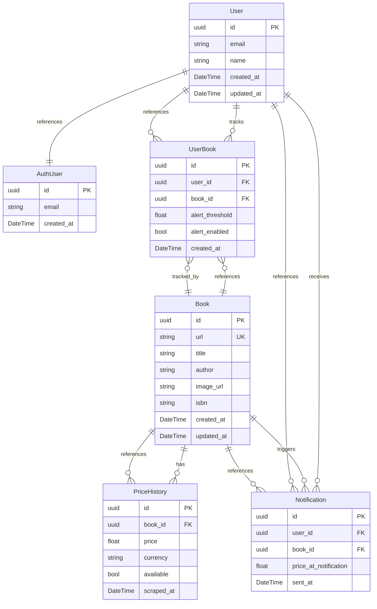

# Data Model Documentation

This document describes the data model for the Buscalibre Price Tracker (LibroBaratito) application, including entity descriptions, field definitions, relationships, and an entity-relationship diagram.

## Model Descriptions

### 1. User
Represents a user who tracks book prices on Buscalibre. This table references Supabase Auth users.

**Fields:**
- `id`: Unique identifier for the user (Primary Key, UUID, references auth.users.id)
- `email`: User's unique email address (max 255 characters)
- `name`: User's name (max 100 characters)
- `created_at`: DateTime when the user was created
- `updated_at`: DateTime of last update

**Validation Rules:**
- Email is required and must be unique
- Name is required

**Row Level Security (RLS):**
- Users can only view their own profile
- Users can only update their own profile
- Insert is managed automatically via trigger when user registers via Supabase Auth

**Relationships:**
- `userBooks`: One-to-many relationship with UserBook model
- `notifications`: One-to-many relationship with Notification model

**Note:** Authentication is handled by Supabase Auth (`auth.users` table). This `public.users` table stores additional profile information and is automatically populated via trigger when a new user registers.

### 2. Book
Represents a book available on Buscalibre.com.

**Fields:**
- `id`: Unique identifier for the book (Primary Key, UUID)
- `url`: Unique URL of the book on Buscalibre (max 500 characters)
- `title`: Book title (max 500 characters)
- `author`: Book author (max 255 characters)
- `image_url`: URL of the book cover image (max 500 characters)
- `isbn`: ISBN number if available (nullable, max 20 characters)
- `created_at`: DateTime when the book was added
- `updated_at`: DateTime of last update

**Validation Rules:**
- URL is required and must be unique
- Title is required
- Author is required

**Relationships:**
- `userBooks`: One-to-many relationship with UserBook model
- `priceHistories`: One-to-many relationship with PriceHistory model
- `notifications`: One-to-many relationship with Notification model

### 3. UserBook
Represents the relationship between a user and a book they are tracking.

**Fields:**
- `id`: Unique identifier (Primary Key, UUID)
- `user_id`: Foreign key referencing the User
- `book_id`: Foreign key referencing the Book
- `alert_threshold`: Price threshold for alerts (nullable, Float)
- `alert_enabled`: Boolean indicating if alerts are active (default: true)
- `created_at`: DateTime when the user added the book

**Validation Rules:**
- User and Book references must exist
- Alert threshold must be a positive number if provided

**Relationships:**
- `user`: Many-to-one relationship with User model
- `book`: Many-to-one relationship with Book model

### 4. PriceHistory
Stores historical price data for books scraped from Buscalibre.

**Fields:**
- `id`: Unique identifier (Primary Key, UUID)
- `book_id`: Foreign key referencing the Book
- `price`: Recorded price (Float)
- `currency`: Currency code (e.g., "CLP", "USD")
- `available`: Boolean indicating if the book is in stock
- `scraped_at`: DateTime when the price was scraped

**Validation Rules:**
- Price must be a positive number
- Currency is required

**Relationships:**
- `book`: Many-to-one relationship with Book model

### 5. Notification
Tracks email notifications sent to users when price thresholds are met.

**Fields:**
- `id`: Unique identifier (Primary Key, UUID)
- `user_id`: Foreign key referencing the User
- `book_id`: Foreign key referencing the Book
- `price_at_notification`: Price when the notification was sent
- `sent_at`: DateTime when the notification was sent

**Relationships:**
- `user`: Many-to-one relationship with User model
- `book`: Many-to-one relationship with Book model

## Entity Relationship Diagram

## Key Design Principles

1. **Supabase Auth Integration**: Authentication is handled by Supabase Auth (`auth.users` table). The `public.users` table stores additional profile information and is automatically populated via trigger when a new user registers.

2. **Row Level Security (RLS)**: All tables with sensitive data have RLS enabled. Policies ensure users can only access their own data.

3. **Referential Integrity**: All foreign key relationships ensure data consistency across the system.

4. **Price Tracking**: The PriceHistory entity allows storing complete price history for analysis and charts.

5. **User Alerts**: The UserBook entity with alert_threshold enables customizable price alerts per user per book.

6. **Notification Audit**: The Notification entity provides an audit trail for all sent price alert emails.

7. **Data Normalization**: The model follows database normalization principles to minimize redundancy and ensure data integrity.

## Notes

- All `id` fields are UUIDs (Primary Keys with auto-generation)
- The `User` table references `auth.users` via foreign key constraint
- RLS is enabled on `public.users` with policies restricting access to own record only
- A trigger (`on_auth_user_created`) automatically creates a user profile when a new user registers via Supabase Auth
- Foreign key relationships maintain referential integrity
- Optional fields allow for flexible data entry while maintaining required core information
- The system supports multiple users tracking the same book with different alert thresholds
- Email fields have unique constraints to prevent duplicate accounts